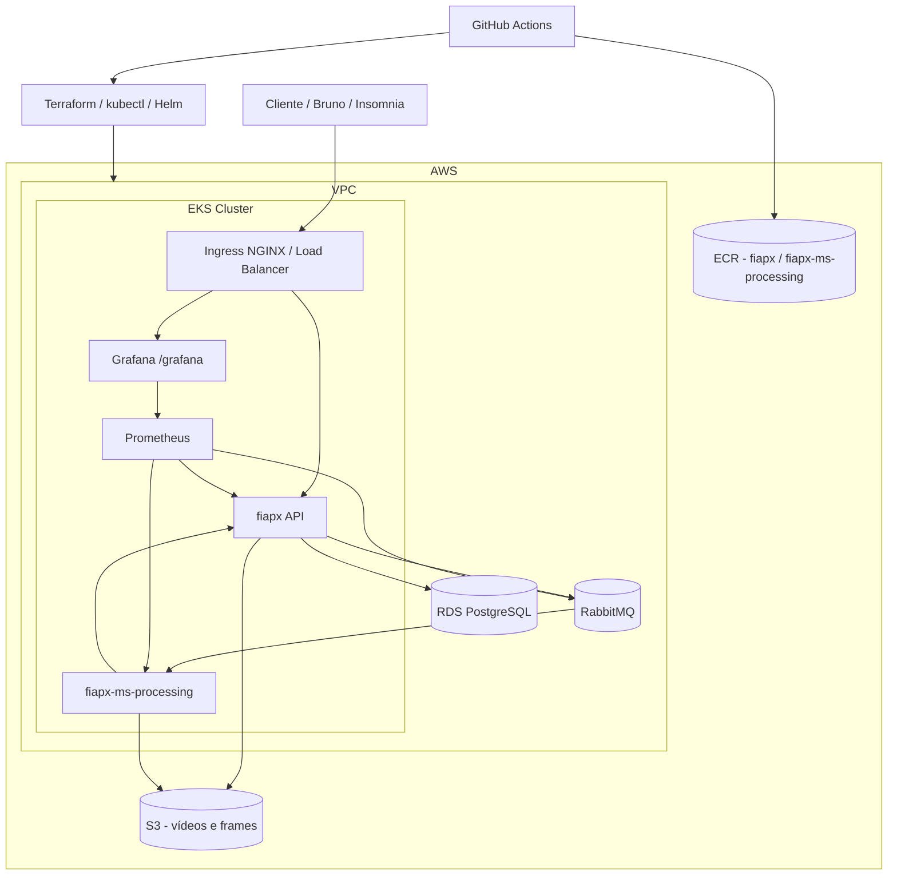

# FIAPX Infraestrutura (`fiapx-infra`)

Repositório responsável por provisionar e manter toda a base de infraestrutura e observabilidade da solução FIAPX na AWS/EKS.

---

## Objetivo

Este repositório entrega:

- Infraestrutura AWS via Terraform
- Plataforma Kubernetes (EKS) pronta para os microsserviços
- Mensageria (RabbitMQ)
- Banco relacional (PostgreSQL RDS)
- Observabilidade (Prometheus + Grafana)
- Pipeline de aplicação de infraestrutura e manifests base

---

## Desenho completo da arquitetura

O diagrama detalhado está em: `architecture.mmd`

---

## Responsabilidade de cada peça

### Terraform (`terraform/`)

- Provisiona VPC, subnets públicas/privadas, NAT, route tables
- Provisiona EKS (cluster + node group)
- Provisiona ECR dos serviços
- Provisiona bucket S3 de vídeos/frames
- Provisiona RDS PostgreSQL
- Instala charts Helm:
  - `ingress-nginx`
  - `kube-prometheus-stack`
  - `rabbitmq`

### Manifests Kubernetes (`k8s/`)

- `namespace.yaml`: namespace padrão da solução
- `secrets.yaml`: template de secret compartilhado pelos serviços
- `ingress.yaml`: exposição da API via `/api`
- `monitoring/ingress-grafana.yaml`: exposição do Grafana via `/grafana`
- `monitoring/dashboard-e2e-fiapx.yaml`: dashboard E2E provisionado automaticamente

### Workflow de infraestrutura (`.github/workflows/infra.yml`)

- bootstrap idempotente do bucket de state Terraform
- `terraform init/plan/apply`
- extração de outputs (EKS, ECR, S3, RDS)
- aplicação de manifests no cluster
- hardening automático:
  - garante regra de SG EKS -> RDS (porta 5432)
  - resolve/fallback do `DB_HOST` no secret
  - valida secret para não aplicar `DB_HOST` vazio

---

## Como a infraestrutura evita recriação desnecessária

O backend de state do Terraform é remoto em S3:

- bucket: `fiapx-terraform-state`
- key: `fiapx/terraform.tfstate`
- região: `us-east-1`

Com o mesmo state e mesma conta, o `terraform apply` faz **reconciliação** do que já existe (não recria tudo do zero), exceto quando há mudança destrutiva explícita no código ou drift que exija replace.

---

## Branches e CI/CD

Workflow de infra dispara em:

- `fix`
- `main`

Isso garante o mesmo comportamento após merge das PRs para `main`.

---

## Checklist de responsabilidade deste repositório

- [x] arquitetura e infraestrutura escalável
- [x] banco persistente (RDS)
- [x] mensageria (RabbitMQ)
- [x] monitoramento (Prometheus/Grafana)
- [x] deploy automatizado com GitHub Actions
- [x] base para os microsserviços `fiapx` e `fiapx-ms-processing`
